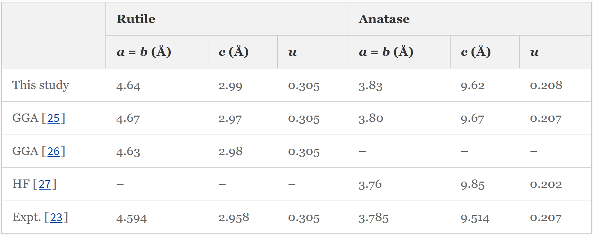

.. TableDataExtractor documentation master file, created by
   sphinx-quickstart on Thu Nov  8 14:26:56 2018.
   You can adapt this file completely to your liking, but it should at least
   contain the root `toctree` directive.

Welcome to TableDataExtractor!
==============================================

.. TODO Add pypi status/version badge once the code is included in Pip

.. TODO Add DOI badge once we have a publication

.. image:: https://travis-ci.com/CambridgeMolecularEngineering/tabledataextractor.svg?token=QWAzgYdPbGciePvYMQM3&branch=master
   :target: https://travis-ci.com/CambridgeMolecularEngineering/tabledataextractor.svg?token=QWAzgYdPbGciePvYMQM3&branch=master
   :alt: build status

.. image:: https://readthedocs.com/projects/cambridgemolecularengineering-tabledataextractor/badge/?version=latest
   :target: https://readthedocs.com/projects/cambridgemolecularengineering-tabledataextractor/badge/?version=latest
   :alt: docs status

.. image:: https://img.shields.io/badge/License-CC%20BY--NC--SA%204.0-lightgrey.svg
   :target: https://creativecommons.org/licenses/by-nc-sa/4.0/
   :alt: CC BY-NC-SA 4.0 (Creative Commons Attribution-NonCommercial-ShareAlike 4.0 International)

Input a table as unstructured **.csv** file, **python list**, **.html** file, or **url** and output a standardized table where each row corresponds to a single data entry in the original table.
TableDataExtractor will take care of complicated header structures in row and column headers, which includes:

   * spanning cells
   * nested column/row headers
   * titles within the table
   * note cells
   * footnotes
   * prefixing of row and column headers if non-unique
   * multiple tables within one

.. tip::
   TableDataExtractor can output to Pandas and will automatically create complex MultiIndex DataFrame structures.

.. rubric:: Example

Importing Table 2 from 'https://link.springer.com/article/10.1007%2Fs10853-012-6439-6':

.. code-block:: python

   from tabledataextractor import Table
   table = Table('https://link.springer.com/article/10.1007%2Fs10853-012-6439-6',2)
   print(table)

::

   +---------+------------------+-------------------------------------+
   |   Data  |  Row Categories  |          Column Categories          |
   +---------+------------------+-------------------------------------+
   |   4.64  | [' This study '] |  [' Rutile ', '  a = b (Å) ']       |
   |   2.99  | [' This study '] |       [' Rutile ', '  c (Å) ']      |
   |  0.305  | [' This study '] |        [' Rutile ', '  u  ']        |
   |   3.83  | [' This study '] | [' Anatase ', '  a = b (Å) ']       |
   |   9.62  | [' This study '] |      [' Anatase ', '  c (Å) ']      |
   |  0.208  | [' This study '] |        [' Anatase ', '  u  ']       |
   |   4.67  |  [' GGA [25] ']  |  [' Rutile ', '  a = b (Å) ']       |
   |   2.97  |  [' GGA [25] ']  |       [' Rutile ', '  c (Å) ']      |
   |  0.305  |  [' GGA [25] ']  |        [' Rutile ', '  u  ']        |
   |   3.80  |  [' GGA [25] ']  | [' Anatase ', '  a = b (Å) ']       |
   |   9.67  |  [' GGA [25] ']  |      [' Anatase ', '  c (Å) ']      |
   |  0.207  |  [' GGA [25] ']  |        [' Anatase ', '  u  ']       |
   |   4.63  |  [' GGA [26] ']  |  [' Rutile ', '  a = b (Å) ']       |
   |   2.98  |  [' GGA [26] ']  |       [' Rutile ', '  c (Å) ']      |
   |  0.305  |  [' GGA [26] ']  |        [' Rutile ', '  u  ']        |
   |    –    |  [' GGA [26] ']  | [' Anatase ', '  a = b (Å) ']       |
   |    –    |  [' GGA [26] ']  |      [' Anatase ', '  c (Å) ']      |
   |    –    |  [' GGA [26] ']  |        [' Anatase ', '  u  ']       |
   |    –    |  [' HF [27] ']   |  [' Rutile ', '  a = b (Å) ']       |
   |    –    |  [' HF [27] ']   |       [' Rutile ', '  c (Å) ']      |
   |    –    |  [' HF [27] ']   |        [' Rutile ', '  u  ']        |
   |   3.76  |  [' HF [27] ']   | [' Anatase ', '  a = b (Å) ']       |
   |   9.85  |  [' HF [27] ']   |      [' Anatase ', '  c (Å) ']      |
   |  0.202  |  [' HF [27] ']   |        [' Anatase ', '  u  ']       |
   |  4.594  | [' Expt. [23] '] |  [' Rutile ', '  a = b (Å) ']       |
   |  2.958  | [' Expt. [23] '] |       [' Rutile ', '  c (Å) ']      |
   |  0.305  | [' Expt. [23] '] |        [' Rutile ', '  u  ']        |
   |  3.785  | [' Expt. [23] '] | [' Anatase ', '  a = b (Å) ']       |
   |  9.514  | [' Expt. [23] '] |      [' Anatase ', '  c (Å) ']      |
   |  0.207  | [' Expt. [23] '] |        [' Anatase ', '  u  ']       |
   +---------+------------------+-------------------------------------+

.. toctree::
   :hidden:
   :maxdepth: 1
   :caption: Contents:

   basic_functionality.nblink
   features.nblink
   source_code/source_code
   license
   acknowledgement

Indices and tables
==================

* :ref:`genindex`
* :ref:`modindex`
