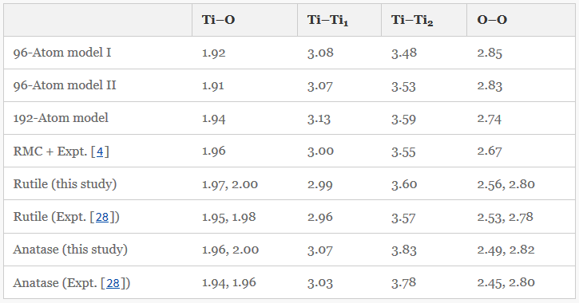

.. TableDataExtractor documentation master file, created by
   sphinx-quickstart on Thu Nov  8 14:26:56 2018.
   You can adapt this file completely to your liking, but it should at least
   contain the root `toctree` directive.

Welcome to TableDataExtractor!
==============================================

Input a table as **.csv** file, **python list**, **.html** file, or **url** and output a standardized table where each row corresponds to a single data entry in the original table.
TableDataExtractor will take care of complicated header structures in row and column headers, which includes:

   * spanning cells
   * nested column/row headers
   * titles within the table
   * note cells
   * footnotes
   * prefixing of row and column headers if non-unique

.. highlights::
   **TableDataExtractor will output to Pandas and will automatically create complex MultiIndex DataFrame structures.**

.. rubric:: Example

Importing Table 3 from 'https://link.springer.com/article/10.1007%2Fs10853-012-6439-6':

::

   from tabledataextractor import Table
   table = Table('https://link.springer.com/article/10.1007%2Fs10853-012-6439-6',3)
   print(table)

::

    +--------------+----------------------------+-------------------+
    |     Data     |       Row Categories       | Column Categories |
    +--------------+----------------------------+-------------------+
    |     1.92     |   [' 96-Atom model I ']    |     [' Ti–O ']    |
    |     3.08     |   [' 96-Atom model I ']    |   [' Ti–Ti1  ']   |
    |     3.48     |   [' 96-Atom model I ']    |   [' Ti–Ti2  ']   |
    |     2.85     |   [' 96-Atom model I ']    |     [' O–O ']     |
    |     1.91     |   [' 96-Atom model II ']   |     [' Ti–O ']    |
    |     3.07     |   [' 96-Atom model II ']   |   [' Ti–Ti1  ']   |
    |     3.53     |   [' 96-Atom model II ']   |   [' Ti–Ti2  ']   |
    |     2.83     |   [' 96-Atom model II ']   |     [' O–O ']     |
    |     1.94     |    [' 192-Atom model ']    |     [' Ti–O ']    |
    |     3.13     |    [' 192-Atom model ']    |   [' Ti–Ti1  ']   |
    |     3.59     |    [' 192-Atom model ']    |   [' Ti–Ti2  ']   |
    |     2.74     |    [' 192-Atom model ']    |     [' O–O ']     |
    |     1.96     |   [' RMC + Expt. [4] ']    |     [' Ti–O ']    |
    |     3.00     |   [' RMC + Expt. [4] ']    |   [' Ti–Ti1  ']   |
    |     3.55     |   [' RMC + Expt. [4] ']    |   [' Ti–Ti2  ']   |
    |     2.67     |   [' RMC + Expt. [4] ']    |     [' O–O ']     |
    |  1.97, 2.00  | [' Rutile (this study) ']  |     [' Ti–O ']    |
    |     2.99     | [' Rutile (this study) ']  |   [' Ti–Ti1  ']   |
    |     3.60     | [' Rutile (this study) ']  |   [' Ti–Ti2  ']   |
    |  2.56, 2.80  | [' Rutile (this study) ']  |     [' O–O ']     |
    |  1.95, 1.98  | [' Rutile (Expt. [28]) ']  |     [' Ti–O ']    |
    |     2.96     | [' Rutile (Expt. [28]) ']  |   [' Ti–Ti1  ']   |
    |     3.57     | [' Rutile (Expt. [28]) ']  |   [' Ti–Ti2  ']   |
    |  2.53, 2.78  | [' Rutile (Expt. [28]) ']  |     [' O–O ']     |
    |  1.96, 2.00  | [' Anatase (this study) '] |     [' Ti–O ']    |
    |      3.07    | [' Anatase (this study) '] |   [' Ti–Ti1  ']   |
    |     3.83     | [' Anatase (this study) '] |   [' Ti–Ti2  ']   |
    |  2.49, 2.82  | [' Anatase (this study) '] |     [' O–O ']     |
    |  1.94, 1.96  | [' Anatase (Expt. [28]) '] |     [' Ti–O ']    |
    |     3.03     | [' Anatase (Expt. [28]) '] |   [' Ti–Ti1  ']   |
    |     3.78     | [' Anatase (Expt. [28]) '] |   [' Ti–Ti2  ']   |
    |  2.45, 2.80  | [' Anatase (Expt. [28]) '] |     [' O–O ']     |
    +--------------+----------------------------+-------------------+

.. toctree::
   :hidden:
   :maxdepth: 1
   :caption: Contents:

   examples
   table_object
   cell_parser
   input
   output
   external

Indices and tables
==================

* :ref:`genindex`
* :ref:`modindex`
* :ref:`search`
